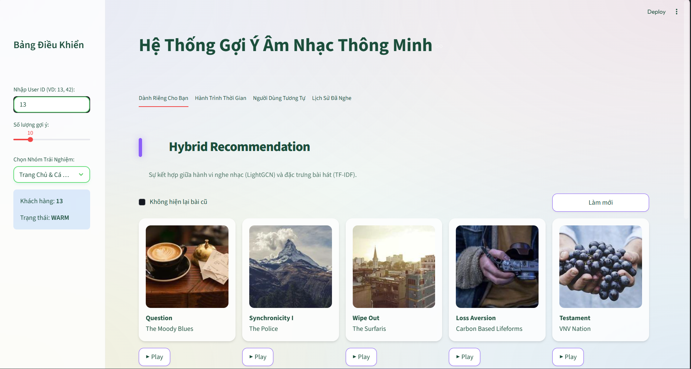
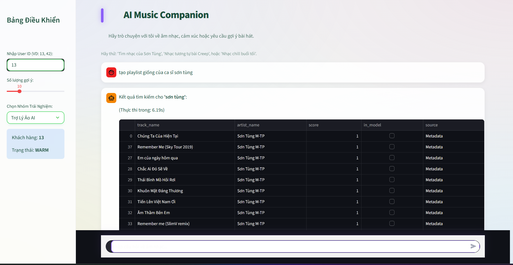

# AI Music Recommender System 🎵

Hệ thống gợi ý âm nhạc thông minh sử dụng thuật toán **LightGCN** kết hợp với **TF-IDF** cho các chiến lược gợi ý đa dạng (Hybrid, Trending, Discovery, Real-time).

## 🚀 Tính năng chính
- **Dành riêng cho bạn**: Gợi ý cá nhân hóa dựa trên hành vi nghe nhạc lịch sử.
- **Khám phá & Xu hướng**: Cập nhật các bài hát đang thịnh hành và đề xuất mới mẻ thoát khỏi vùng an toàn.
- **Playlist Generator**: Tự động tạo danh sách phát dựa trên bài hát hoặc nghệ sĩ yêu thích.
- **AI Chatbot**: Trò chuyện và yêu cầu gợi ý âm nhạc thông qua trợ lý AI (tích hợp Claude).
- **Trình phát nhạc tích hợp**: Nghe nhạc trực tiếp trên trình duyệt với giao diện hiện đại.

---

## 📁 Cấu trúc thư mục
Dự án được tổ chức theo chuẩn module để dễ dàng quản lý và mở rộng:

```text
Recommend-System-feature-optimize-rs/
├── app.py                      # Điểm khởi chạy ứng dụng (Streamlit entry point)
├── src/                        # Chứa toàn bộ mã nguồn của dự án
│   ├── core/                   # Logic xử lý chính và thuật toán gợi ý
│   │   └── recommender.py      # Engine điều khiển (LocalRecommender)
│   └── ui/                     # Các module giao diện người dùng
│       ├── chatbot.py          # Giao diện và logic Chatbot AI
│       ├── components.py       # Các thành phần UI dùng chung (CSS, Card, Player)
│       ├── tab_home.py         # Tab Trang chủ & Cá nhân
│       ├── tab_discovery.py    # Tab Khám phá & Xu hướng
│       └── ...                 # Các tab chức năng khác
├── data/                       # Chứa dữ liệu thô và các tệp âm thanh
│   ├── songs/                  # Thư mục chứa các file .mp3 (Cần bổ sung tay)
│   └── archives/               # Lưu trữ các file nén dữ liệu
├── model/                      # Chứa các trọng số model và database mapping
│   ├── mappings.db             # SQLite database chứa metadata bài hát
│   ├── index_mappings.pkl      # Ánh xạ index người dùng/vật phẩm
│   └── ...                     # Các file .npy và .npz của LightGCN
├── notebooks/                  # Thư mục lưu trữ các file Jupyter Notebook thử nghiệm
├── scripts/                    # Các script tiện ích hỗ trợ (kiểm tra DB, convert dữ liệu)
├── requirements.txt            # Danh sách các thư viện cần thiết
└── README.md                   # Hướng dẫn sử dụng dự án
```

---

## 🛠️ Hướng dẫn cài đặt & Sử dụng

### 1. Yêu cầu hệ thống
- Python 3.9+
- RAM: Tối thiểu 8GB (Hệ thống đã được tối ưu hóa sử dụng SQLite Proxy để tiết kiệm RAM).

### 2. Chuẩn bị dữ liệu
> [!IMPORTANT]
> Do dung lượng lớn, thư mục `model/` và `data/songs/` không được đưa lên Git.

- **Model**: Tải các tệp model tại [Kaggle Dataset](https://www.kaggle.com/datasets/b22dckh068donngkhoa/lightgcn-model). Giải nén và đặt tất cả vào thư mục `model/`.
- **Âm nhạc**: Thêm các file nhạc dạng `.mp3` vào thư mục `data/songs/` để tính năng Player hoạt động.

### 3. Cài đặt thư viện
Mở terminal tại thư mục gốc và chạy lệnh:
```bash
pip install -r requirements.txt
```

### 4. Khởi chạy ứng dụng
Chạy lệnh sau để bắt đầu trải nghiệm:
```bash
streamlit run app.py
```

---

## 🐳 Triển khai với Docker

Nếu bạn muốn chạy ứng dụng trong container để đảm bảo tính nhất quán:

### 1. Build Image
```bash
docker build -t music-recommender .
```

### 2. Run Container
```bash
docker run -p 8501:8501 music-recommender
```
Sau đó truy cập: `http://localhost:8501`

---

## 🖼️ Giao diện Demo

Dưới đây là một số hình ảnh thực tế từ hệ thống:

### 1. Trang chủ & Gợi ý Hybrid

*Giao diện sáng sủa theo phong cách "Minimalist Maximalism" với các thẻ bài hát trực quan.*

### 2. Trợ lý ảo AI Chatbot

*Hỗ trợ tìm kiếm, tạo playlist và trả lời câu hỏi về âm nhạc bằng ngôn ngữ tự nhiên.*

---

